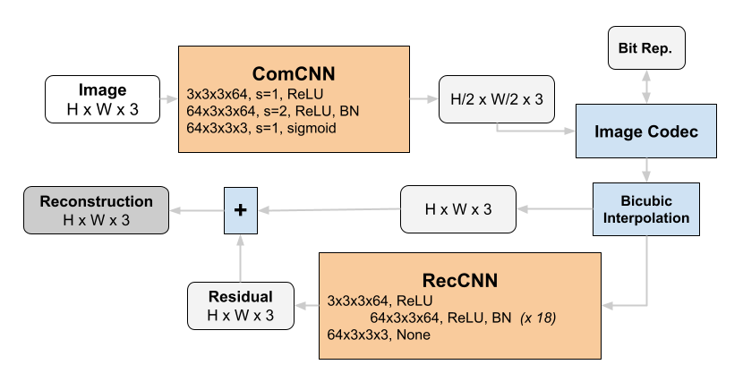
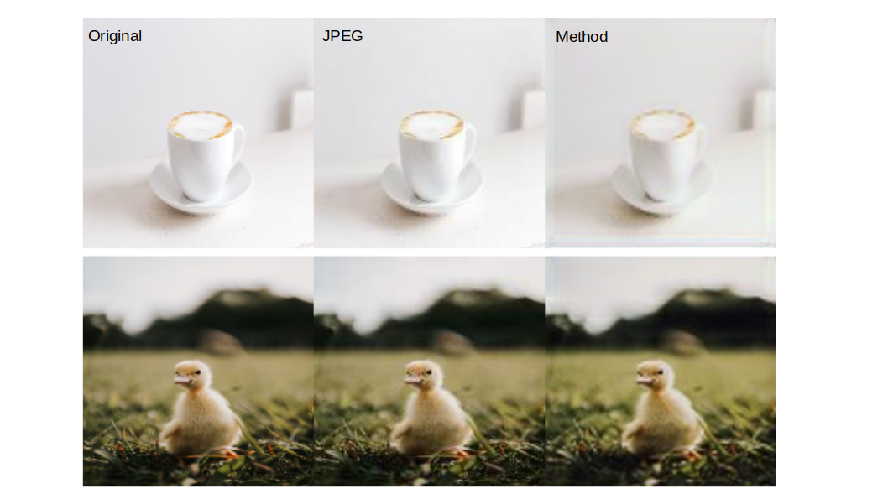

# ML Image Compression

### Contents
- Some of my notes on traditional compression in [./JPEG Compression.ipynb](https://github.com/ksanjeevan/ml-image-compression/blob/master/JPEG%20Compression.ipynb)

- [Implementations](#imp)
	- [1. *An End-to-End Compression Framework Based on Convolutional Neural Networks*](#full)
	- [2. *Learning Convolutional Networks for Content-weighted Image Compression*](#cont)

- [Papers & Resources](#papes)	

## Implementations <a name="imp"/>

 <a name="full"/>
 
#### [1. *An End-to-End Compression Framework Based on Convolutional Neural Networks*](https://arxiv.org/pdf/1708.00838v1.pdf)

##### Architecture

Architecture used in this repo:

###### Results

Trained the method to achive a **75.3%** SSIM on the test split of the [CLIC dataset](https://www.tensorflow.org/datasets/catalog/clic).

##### Notes

- Paper doesn't explicitly mention this but using normalization of the rgb values helped with training

- Making the output of the `Cr` network go through a `sigmoid` before going into `Co` gave better results and makes sense for the gradients to flow although not mentioned in the paper

- Some of the notation of `Co(x_hat)` in the paper is confusing when showing the residual loss, using eq. (5) works fine

- Because of the `"same"` padding used in the architecture, seeing somme ugly border artifacts in the reconstructed images

<a name="cont"/>

#### [2. *Learning Convolutional Networks for Content-weighted Image Compression*](https://openaccess.thecvf.com/content_cvpr_2018/papers/Li_Learning_Convolutional_Networks_CVPR_2018_paper.pdf) 

##### Architecture

##### Results

##### Notes

## Papers & Resources <a name="papes"/>

- [An End-to-End Compression Framework Based on Convolutional Neural Networks](https://arxiv.org/pdf/1708.00838v1.pdf): encoder/decoder architecture tries to learn a compact, image-like representation of an image and use an image codec to store it, then uses interpolation + decoder network in the reconstruction

- [Better Compression with Deep Pre-Editing](https://arxiv.org/pdf/2002.00113.pdf): Learns a transform on the original image such that it can be modified into a "similar" image that can be compressed by a traditional codec but with less artifacts.

- [Learning Convolutional Networks for Content-weighted Image Compression](https://openaccess.thecvf.com/content_cvpr_2018/papers/Li_Learning_Convolutional_Networks_CVPR_2018_paper.pdf): encoder/decoder architecture that extracts a spatial importance mask to predict optimal bit allocation

- [High-Fidelity Generative Image Compression](https://arxiv.org/pdf/2006.09965.pdf): google paper on GANs for compression ([code](https://github.com/tensorflow/compression/tree/master/models/hific))

- [Deep Generative Models for Distribution-Preserving Lossy Compression](https://arxiv.org/pdf/1805.11057.pdf): training GANs with flexible bitrate. The resulting models behave like generative models at zero bitrate, almost perfectly reconstruct the training data at high enough bitrate ([code](https://github.com/mitscha/dplc))

- [Full Resolution Image Compression with Recurrent Neural Networks](https://openaccess.thecvf.com/content_cvpr_2017/papers/Toderici_Full_Resolution_Image_CVPR_2017_paper.pdf): google paper on using different kinds of RNNs ([blog](https://ai.googleblog.com/2016/09/image-compression-with-neural-networks.html))

- [Improved Lossy Image Compression with Priming and Spatially Adaptive Bit Rates for Recurrent Networks](https://arxiv.org/pdf/1703.10114.pdf): google paper that uses RNNs to progressively reconstruct an image

- [Nonlinear Transform Coding](https://arxiv.org/pdf/2007.03034.pdf): ([video talk](https://www.youtube.com/watch?v=x_q7cZviXkY))

- [ML Image Compression Benchmark review](https://arxiv.org/pdf/2002.03711.pdf)

- [tensorflow compression repo](https://github.com/tensorflow/compression)

		
